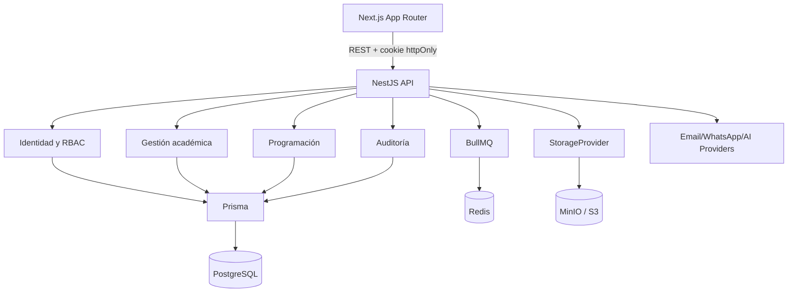

# Arquitectura

Monolito modular en monorepo. Los límites de módulo separan aplicación, dominio e infraestructura y permiten extraer módulos cuando exista una razón operativa.

REST usa DTO validados, errores uniformes, correlación, paginación y Swagger. Operaciones críticas usan transacciones. Fechas se almacenan como `timestamptz`. UUID es el identificador público.
