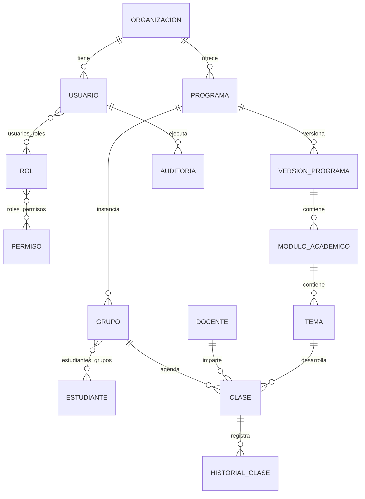

# Modelo de datos

Las tablas principales incorporan UUID, organización, `created_at`, `updated_at`, actor, borrado lógico y versión. Índices cubren estado, fechas, claves foráneas y búsquedas. PostgreSQL aplica unicidad e integridad además de la validación de aplicación.
