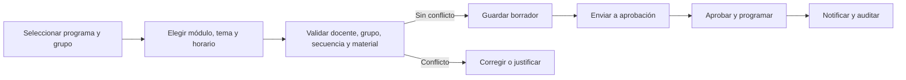
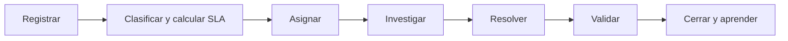
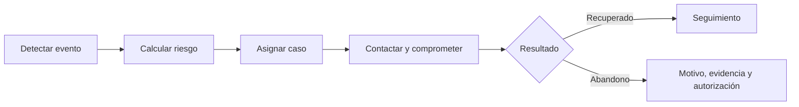
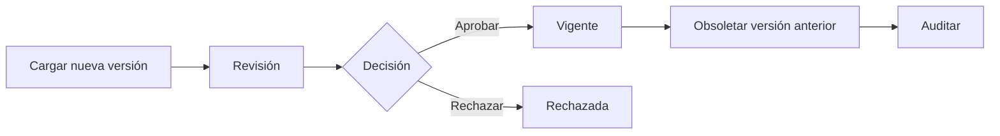

# Procesos

## Programar una clase

Responsable: coordinador. Actores: asistente, docente, líder docente. Estados: borrador → pendiente de aprobación → programada → confirmada → en ejecución → ejecutada; excepciones: reprogramada, cancelada, observada.

## Incidencias

## Retención

## Control documental

